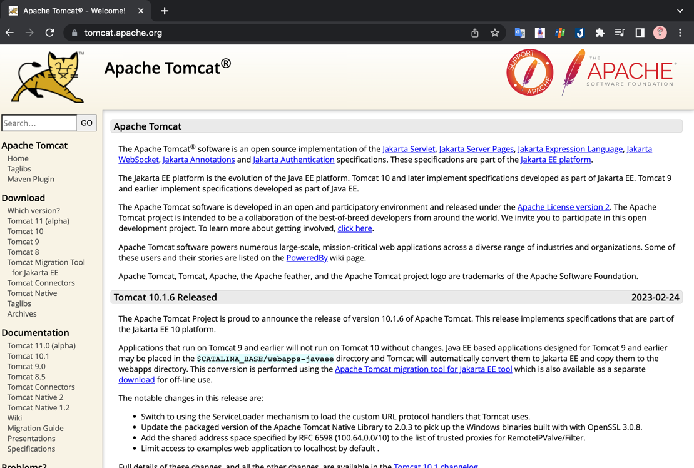
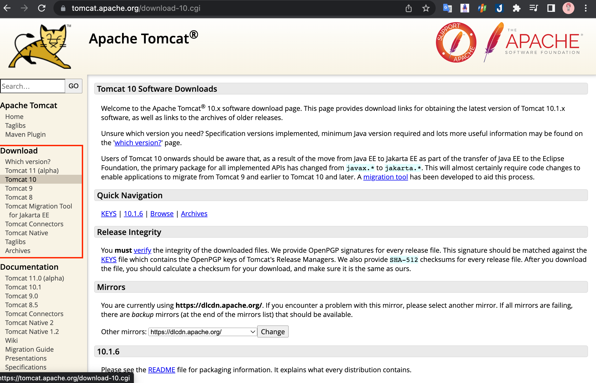
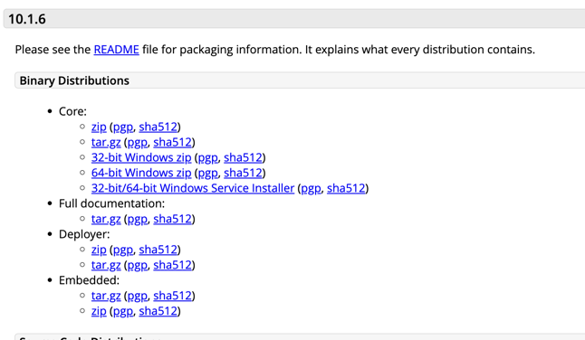
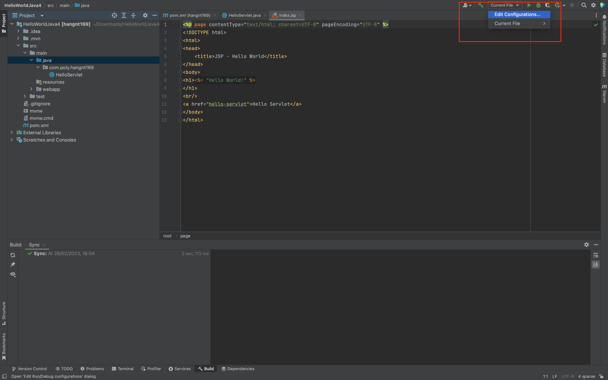
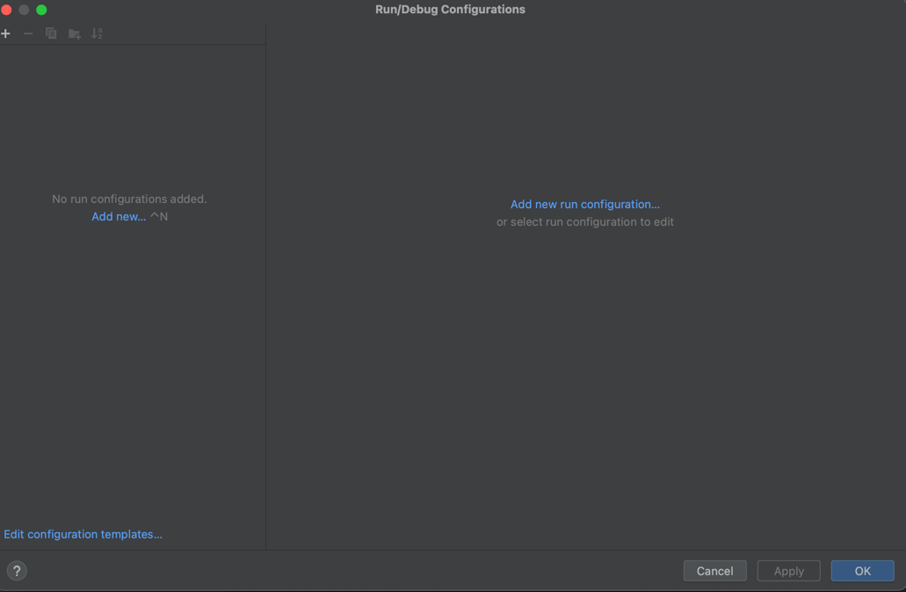
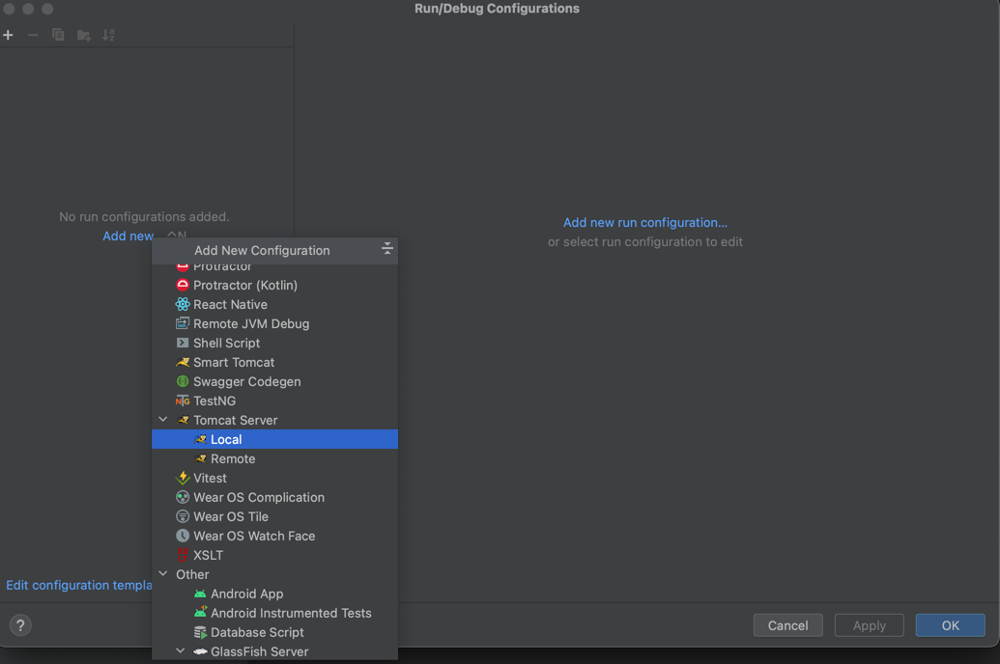
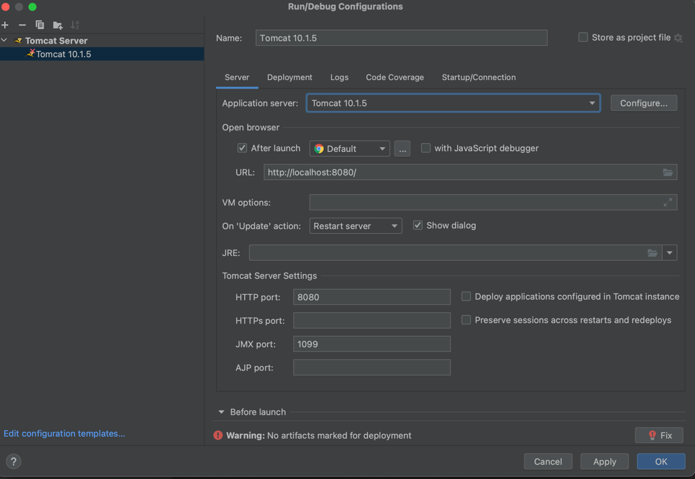

## Các bước chạy project Java Web JSP-Servlet trên Intellij với tomcat server
### Bước 1: Tìm và download tomcat trên google [tại đây](https://tomcat.apache.org/)

### Bước 2: Chọn version tomcat muốn download

### Bước 3: Chọn phiên bản zip phù hợp với máy của bạn để tải về 

### Bước 4: Sau khi tải về giải nén và lưu ở 1 nơi cố định trong máy 
### Bước 5: Setup tomcat cho project nhé
#### 5.1 : Chọn vào current file và chọn vào edit (như hình)
 

#### 5.2: Chọn vào Add new 
 

#### 5.3: Tìm và chọn Tomcat (Local)

#### 5.4: Setup những thông tin sau 
 

 
Các bạn có thể xem thêm video hướng dẫn tại đây : [tại đây](https://youtu.be/3JiWOF-KM5c)

## The End
