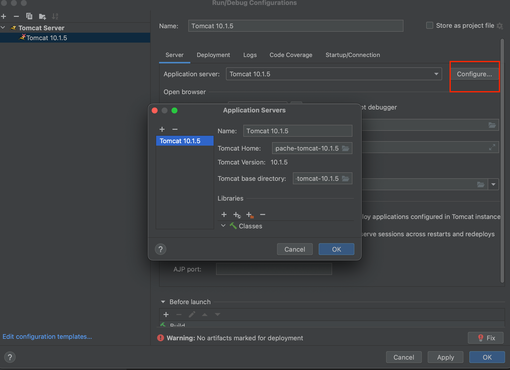
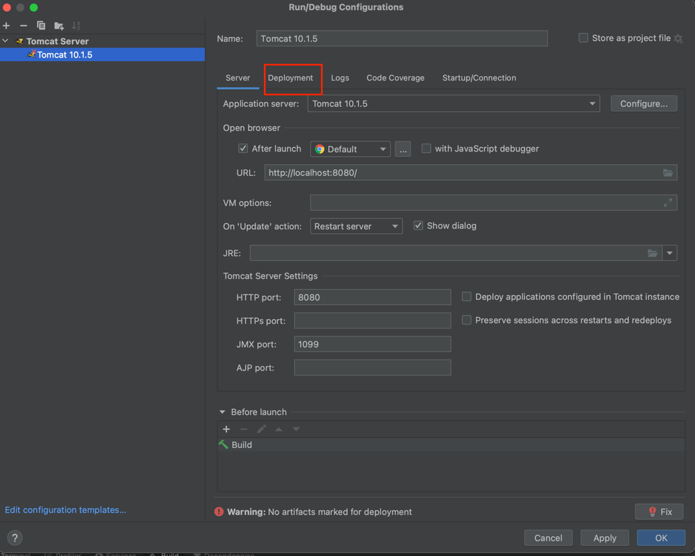
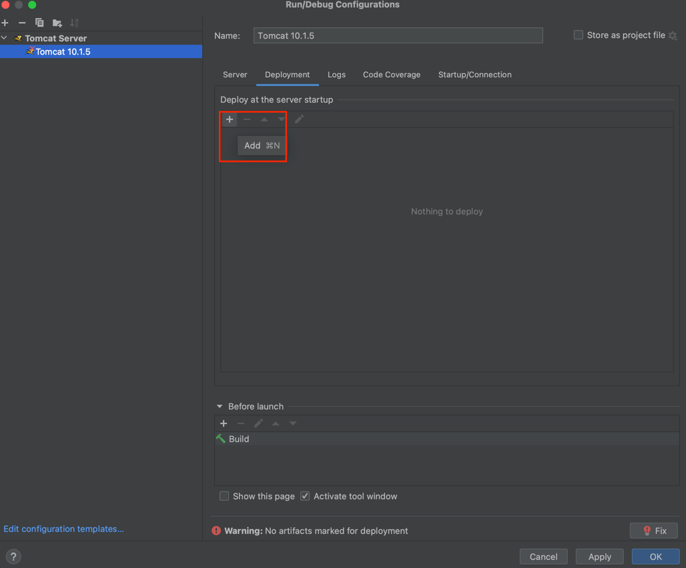
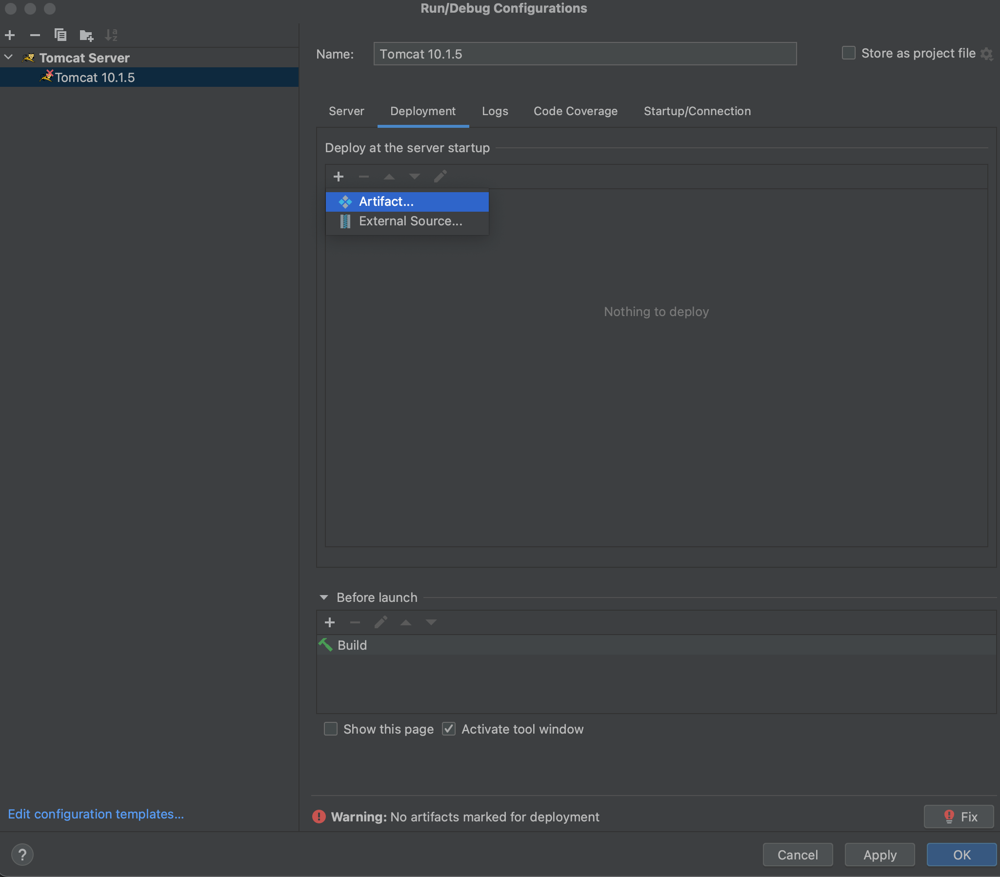
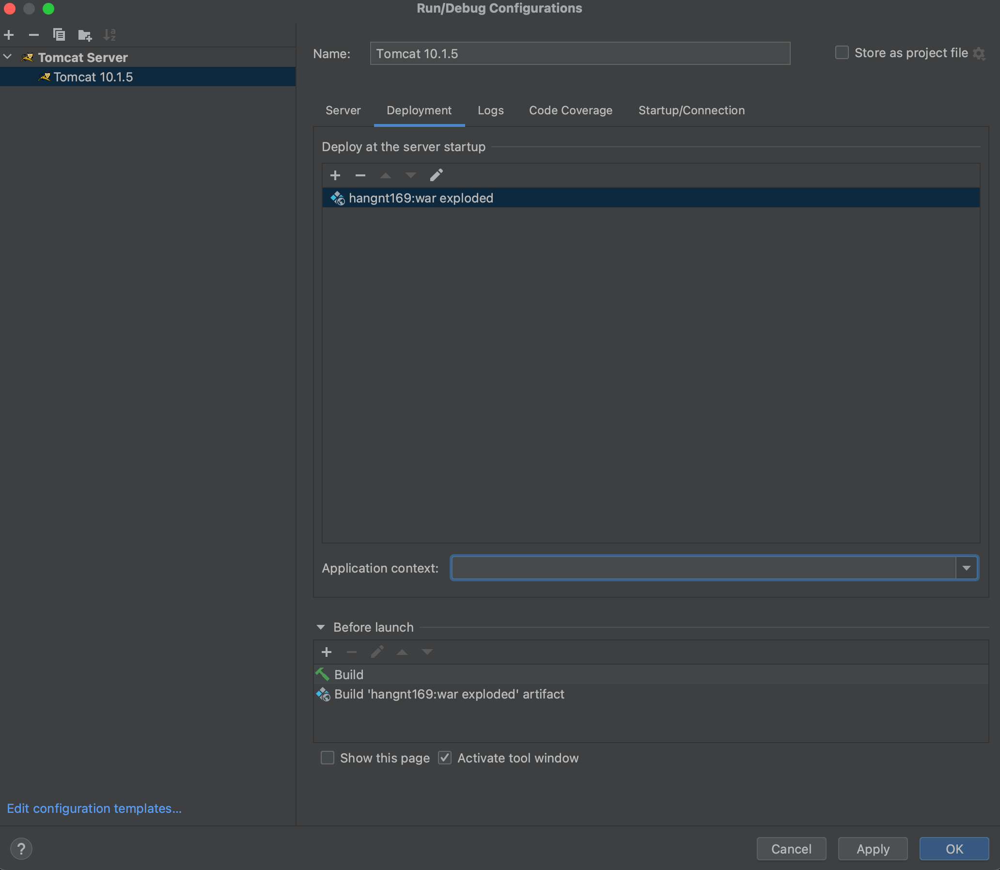
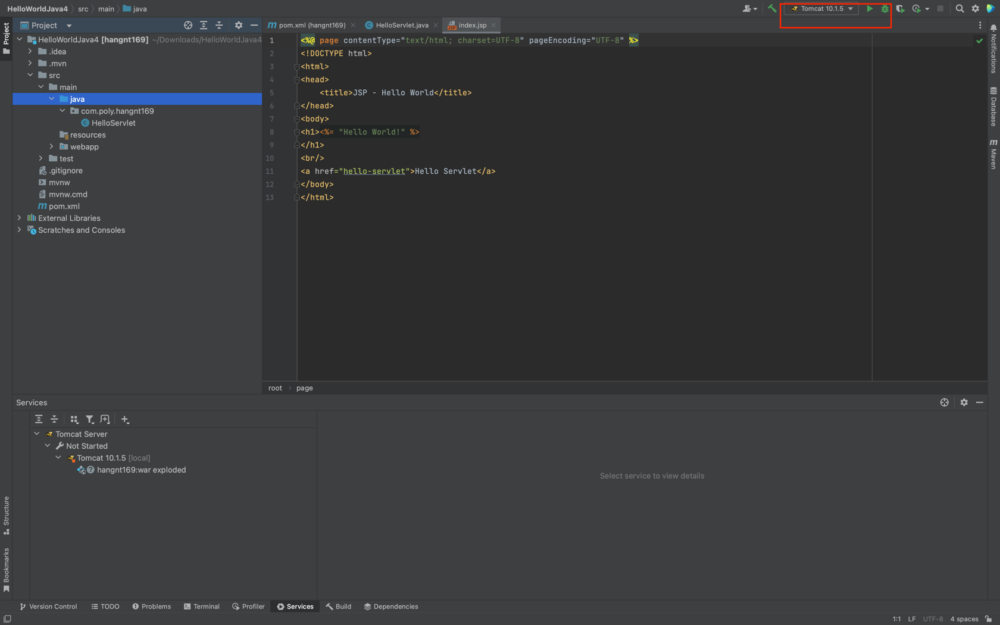
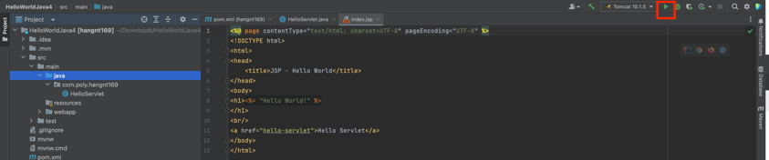
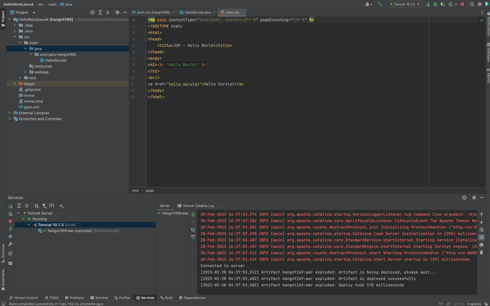
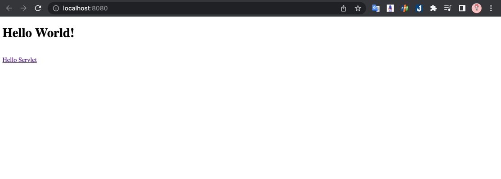

## Các bước chạy project Java Web JSP-Servlet trên Intellij với tomcat server
### Bước 1: Tìm và download tomcat trên google [tại đây](https://tomcat.apache.org/)

### Bước 2: Chọn version tomcat muốn download

### Bước 3: Chọn phiên bản zip phù hợp với máy của bạn để tải về 

### Bước 4: Sau khi tải về giải nén và lưu ở 1 nơi cố định trong máy 
### Bước 5: Setup tomcat cho project nhé
#### 5.1 : Chọn vào current file và chọn vào edit (như hình)
 

#### 5.2: Chọn vào Add new 
 

#### 5.3: Tìm và chọn Tomcat (Local)

#### 5.4: Ấn vào configure  

#### 5.5 Chọn nơi mà các bạn lưu tomcat khi download ở trên 

#### 5.6 Sau khi setup xong các bạn sang phần deployment 
 

#### 5.7 Ấn vào dấu cộng 
 
#### 5.8 Chọn Arifact 

#### 5.9 Chọn cái thứ 2 
 
#### 5.10 Sau khi chọn xong có thể xoá ở phần application context hoặc không 

#### 5.11 Ấn OK và đây là giao diện sau khi setup tomcat cho project xong 
 
#### 5.12 Ấn vào nút start để chạy 
 

Và đây là kết quả sau khi chạy 
 
 
Đây là trình duyệt 
 
 
Như vậy là các bạn đã hoàn thành việc setup tomcat vào project để chạy trên intellij
 
Các bạn có thể xem thêm video hướng dẫn tại đây : [tại đây](https://youtu.be/3JiWOF-KM5c)

## The End
