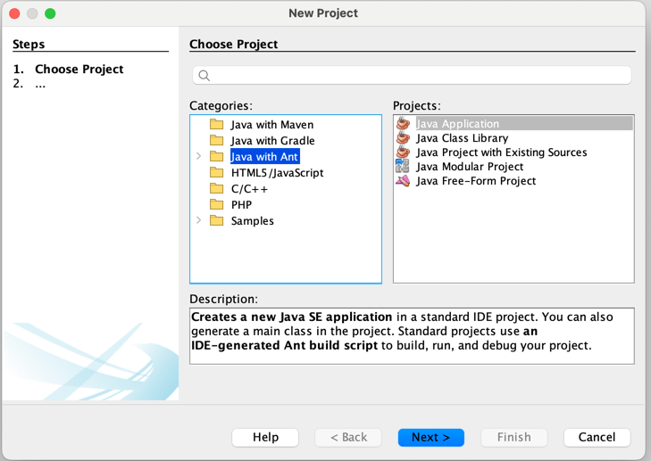
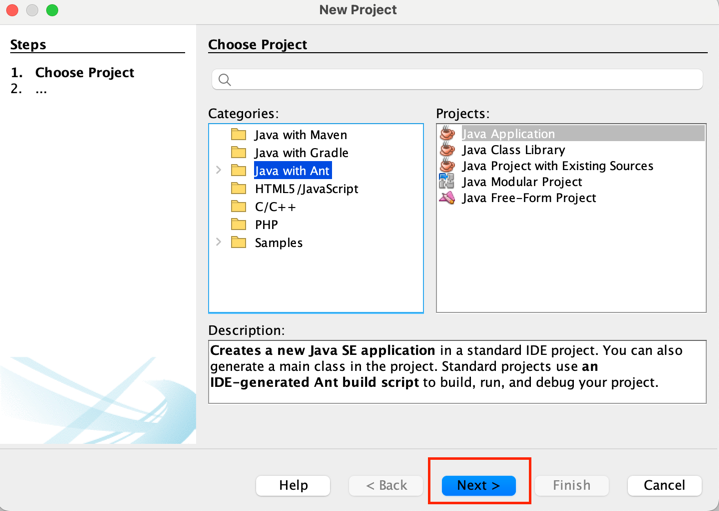
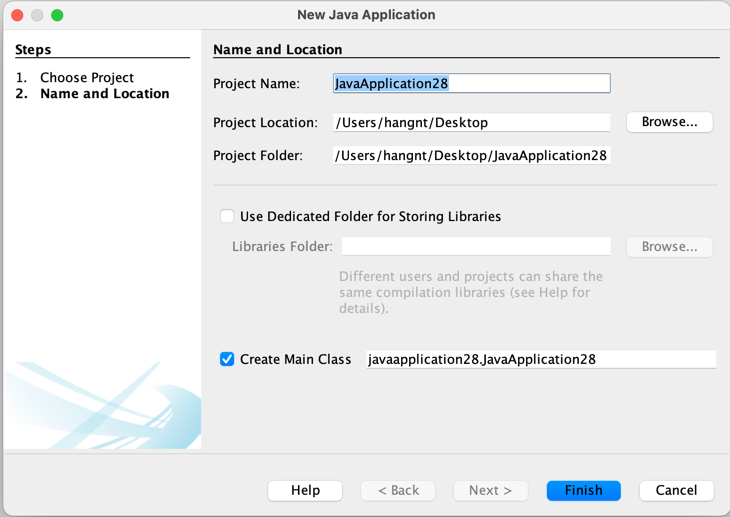
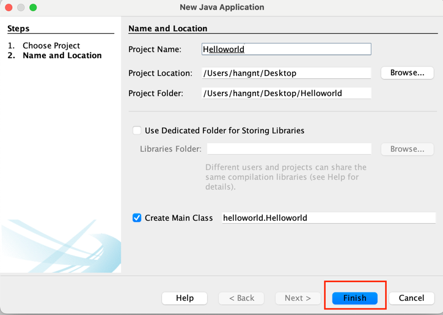
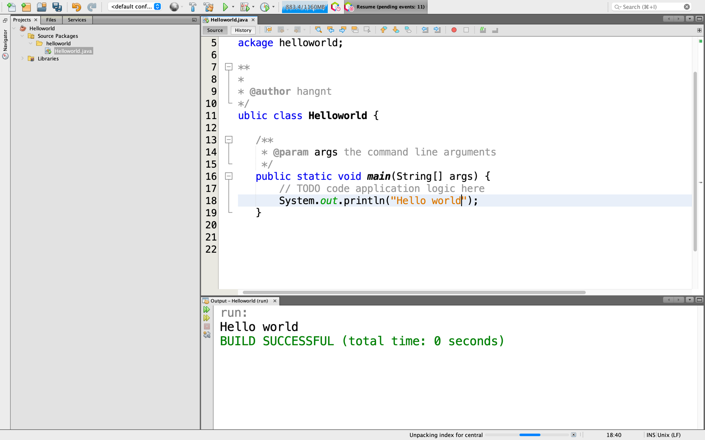

## Các bước tạo project cho Java 1-3:
### Bước 1: Mở netbean chọn project 
 

### Bước 2: Chọn vào loại Java with Ant 

### Bước 3: Ấn next 

### Bước 4: Điền thông tin 

Với Project Name : Là tên của project. Chú ý tên project không dấu
 
Với Project Location : Là nơi lưu của project. Đường dẫn lưu project tuyệt đối không được chứa tiếng việt và khoảng trắn.

### Bước 5: Ấn finish 

#### Vậy là các bạn đã tạo xong project sử dụng cho java 1-3.

 
Các bạn có thể xem thêm video hướng dẫn tại đây : [tại đây](https://youtu.be/3JiWOF-KM5c)

## The End