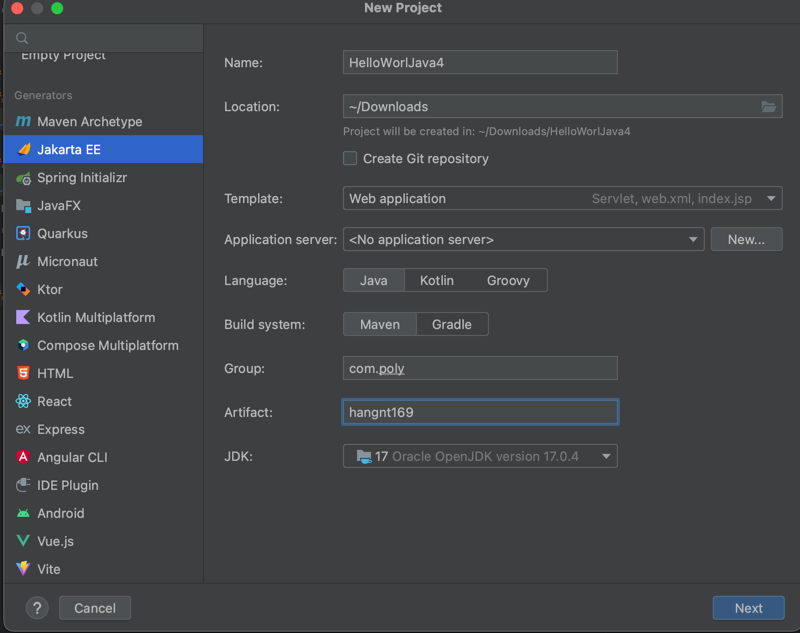
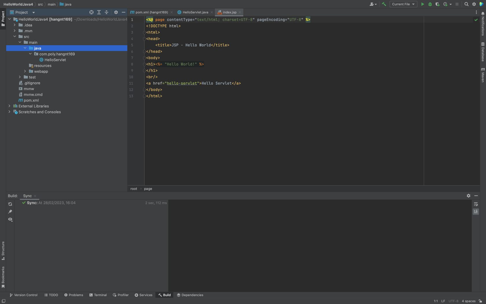

## Các bước tạo project Java Web JSP-Servlet trên Intellij
### Bước 1: Chọn new project và chọn Jakarta EF

### Bước 2: Điền thông tin và ấn next

Name : Tên project 
Location : Nơi lưu project 
Template : Chọn web application 
Phần Group, Artifact (có thể sửa hoặc không)
Laguage : Chọn Java 
Build system: Có thể chọn Maven hoặc Gradle đều được
### Bước 3: Ấn next tiếp tới khi project được tạo thành công

#### Vậy là các bạn đã tạo xong project sử dụng cho java 4.

 
Các bạn có thể xem thêm video hướng dẫn tại đây : [tại đây](https://youtu.be/3JiWOF-KM5c)

Video hướng dẫn của cô HangNT169: [tại đây](https://www.youtube.com/watch?v=70Qpc0PO8sc&list=PLLoi_UNiyVQYnBexjr_F_EUPB76plrvzw&index=3)

## The End
