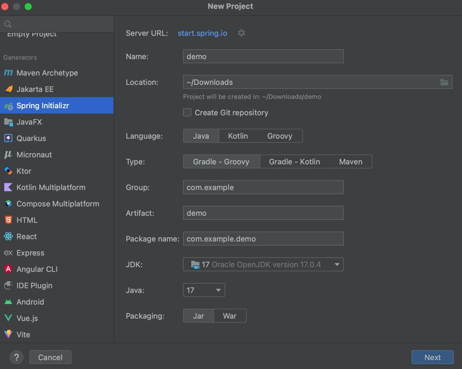
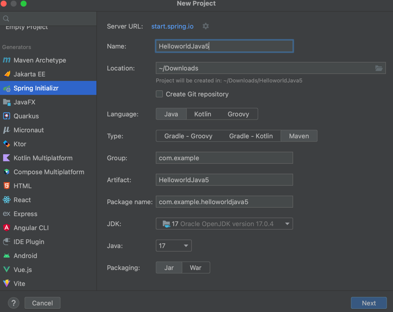
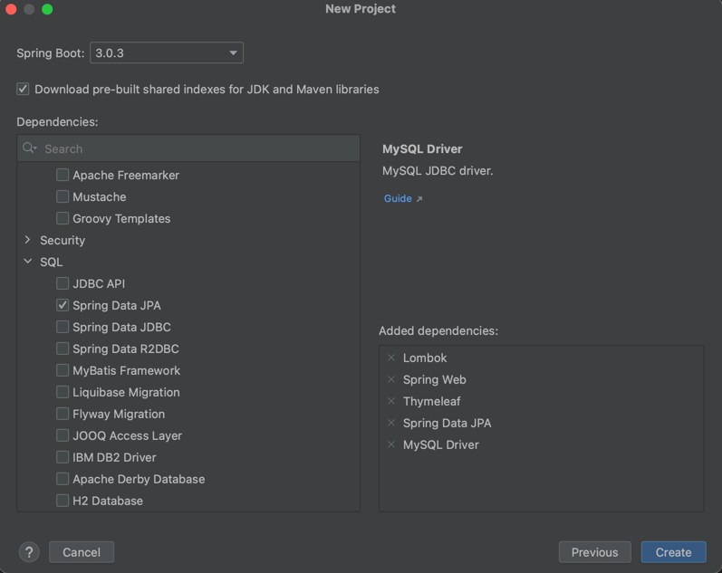
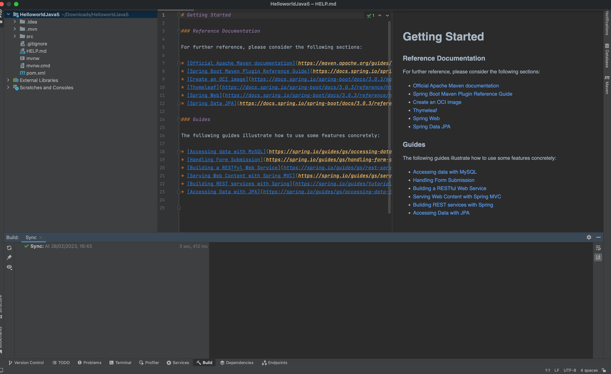
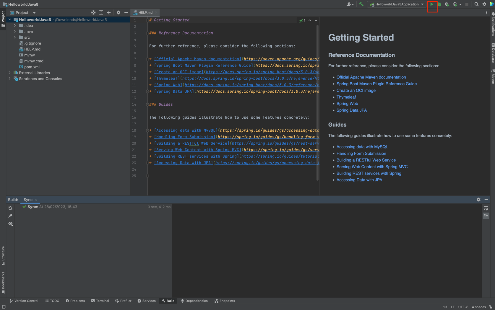

## Các bước tạo project Spring Boot trên Intellij
### Bước 1: Chọn new project và chọn Spring Initializr

### Bước 2: Điền thông tin và ấn next

Name : Tên project
Location : Nơi lưu project
Template : Chọn web application
Phần Group, Artifact (có thể sửa hoặc không)
Laguage : Chọn Java
Build system: Có thể chọn Maven hoặc Gradle đều được
### Bước 3: Ấn next tiếp và chọn thư viện cần cho project 

#### Vậy là các bạn đã tạo xong project sử dụng cho java 5.
 
#### Để chạy các bạn  chỉ cần ấn vào button run để chạy
 
 
Các bạn có thể xem thêm video hướng dẫn tại đây : [tại đây](https://youtu.be/3JiWOF-KM5c)

## The End
