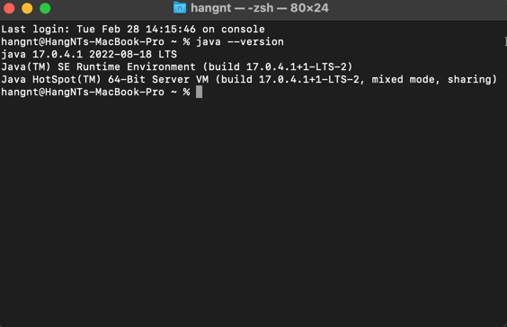

Xin chào các bạn. Hiện tại bộ môn UDPM ngành PTPM Java đang sử dụng jdk 
có version là 17 và netbean dành cho Java 1-3 (Netbean nên chọn 12.4 trở lên)
## Kiểm tra version JDK 
####  Bật command và nhập lệnh sau :
``` 
java --version
```



Chạy xong câu lệnh đấy ra version là 17 là được.
<br/>
Các bạn có thể xem thêm cách cài jdk 17 và netbean tại đây : [tại đây](https://youtu.be/3JiWOF-KM5c) 

## The End